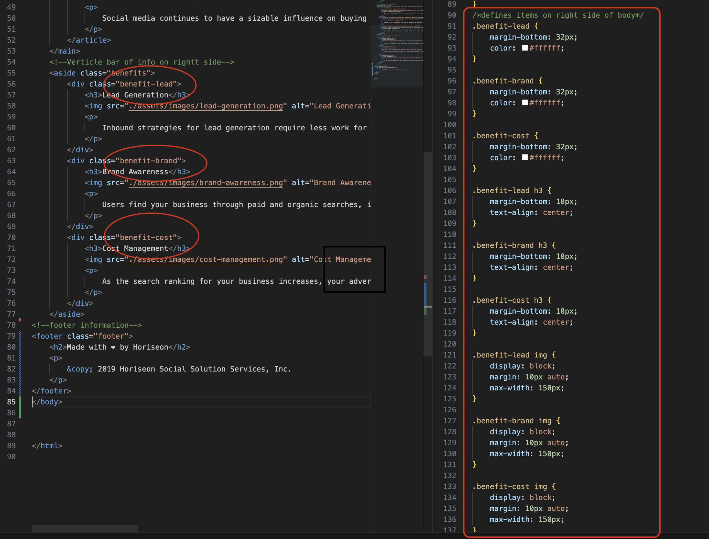
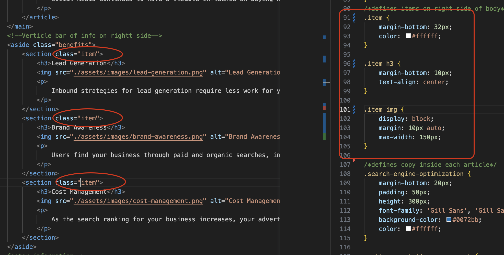

# 01_Challenge_Code-Refracting-with-HTML-and-CSS
## Adjusting HTML and associated taglines in CSS to make a Semantic reading file

- Having a Semantic reading file allows people with disabilties to better read the information on the website.
- This project has shown me the different responsibilites of a UX developer verses a Software developer and it's importance to not change the file structure.
- Alt tags allow reader to understand photos, that they may not be able to see.
- Labeling sections allows them to understand what area of the site they are on.
- Minimal changes should be made to the file in order for UX developer to go back and make changes, and to be able to still understand what CSS styles have been added.

Snippet showing before condensing CSS

Snippet showing after condensing CSS AND change to HTML

## Usage
GitHub repository can be downloaded from:
 https://github.com/PamWillis/01_Challenge_Code-Refracting-with-HTML-and-CSS.git.

Deployed website: https://pamwillis.github.io/01_Challenge_Code-Refracting-with-HTML-and-CSS/

The Horiseon webpage includes a navigation bar, a header image, and cards with text and images at the bottom of the page. This represents a mockup of the final page

